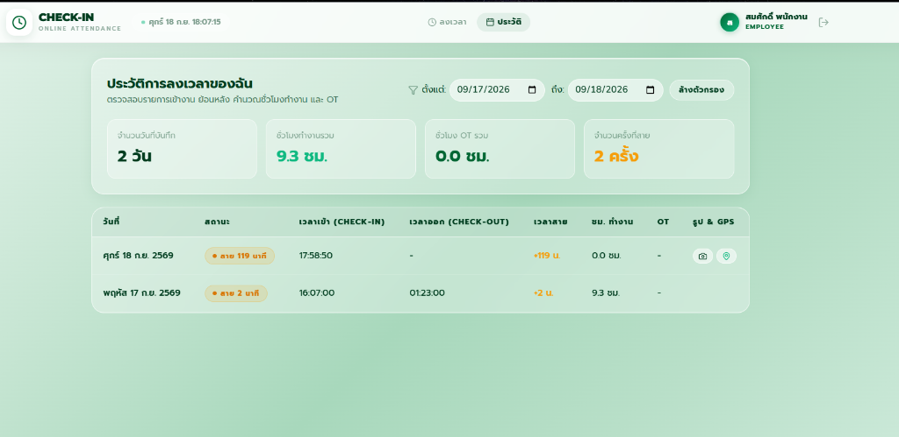

# 📋 รายงานผลการทดสอบ Day 04 — Employee History & Date Filter Evidence

เอกสารรวบรวมรายละเอียดฟังก์ชันใหม่ การใส่ข้อมูลทดสอบ (Seed Data) และผลการทดสอบจริง (Runtime Evidence) สำหรับการปิดงาน **Day 04** ของระบบ Online Attendance Check-in

---

## 📌 สรุปงานที่ทำใน Day 04 (Features & Code Changes)

| ข้อ | รายการ | รายละเอียดการพัฒนา | ไฟล์ที่เกี่ยวข้อง |
|:---:|---|---|---|
| **1** | **หน้าจอ EmployeeHistoryPage** | เพิ่มหน้าแสดงประวัติการลงเวลาส่วนตัวของพนักงาน แสดงรายการ วันที่, เวลาเข้า, เวลาออก, สถานะ (Badge สีตามประเภท), เวลาทำงาน, และ OT พร้อมการ์ดสรุปสถิติ (ชั่วโมงทำงานรวม, OT รวม, วันที่มาสาย) | [`F_END/src/pages/EmployeeHistoryPage.jsx`](file:///c:/Users/n/Desktop/check-in_v2/checkinGGZ/GGZCHECKIN/F_END/src/pages/EmployeeHistoryPage.jsx) *(NEW)* |
| **2** | **ระบบกรองช่วงวันที่ (Date Range Filter)** | Date Picker สำหรับเลือก `startDate` และ `endDate` กรองข้อมูลย้อนหลังตามช่วงที่ต้องการ พร้อมปุ่ม **"ล้างตัวกรอง"** เพื่อรีเซ็ตกลับเป็นประวัติทั้งหมด | [`F_END/src/pages/EmployeeHistoryPage.jsx`](file:///c:/Users/n/Desktop/check-in_v2/checkinGGZ/GGZCHECKIN/F_END/src/pages/EmployeeHistoryPage.jsx)<br>[`B_END/src/routes/attendance.js`](file:///c:/Users/n/Desktop/check-in_v2/checkinGGZ/GGZCHECKIN/B_END/src/routes/attendance.js) |
| **3** | **เมนูและการเชื่อมต่อ Routing** | เพิ่ม Tab เมนู **"ประวัติ"** (Calendar Icon) ในแถบ Navigation Bar ของพนักงาน และเชื่อมต่อ Route เข้ากับ App Router | [`F_END/src/components/Navbar.jsx`](file:///c:/Users/n/Desktop/check-in_v2/checkinGGZ/GGZCHECKIN/F_END/src/components/Navbar.jsx)<br>[`F_END/src/App.jsx`](file:///c:/Users/n/Desktop/check-in_v2/checkinGGZ/GGZCHECKIN/F_END/src/App.jsx) |
| **4** | **เตรียมข้อมูลทดสอบย้อนหลัง (Seed Data)** | นำเข้าข้อมูลประวัติการลงเวลาย้อนหลังหลากหลายสถานะ (ตรงเวลา, สาย, WFH, ลา, ขาดงาน) ให้ครบทุก User สำหรับทดสอบการกรองและแสดงผล | [`B_END/src/seed.js`](file:///c:/Users/n/Desktop/check-in_v2/checkinGGZ/GGZCHECKIN/B_END/src/seed.js) |
| **5** | **Automated Test Suite สำหรับ Day 04** | สคริปต์ทดสอบอัตโนมัติ 9 กรณีทดสอบ (Negative, Positive, Range Filter, Pagination, Data Isolation, E2E Sync) | [`B_END/test_day04_history.js`](file:///c:/Users/n/Desktop/check-in_v2/checkinGGZ/GGZCHECKIN/B_END/test_day04_history.js) *(NEW)* |

---

## 👥 ข้อมูลทดสอบในระบบ (Test Accounts & Credentials)

> **รหัสผ่านสำหรับทุกบัญชี:** `123456`

| บทบาท (Role) | อีเมล (Email) | ชื่อ - นามสกุล | วัตถุประสงค์ในการทดสอบ |
| :--- | :--- | :--- | :--- |
| **Employee** | `employee1@company.com` | สมศักดิ์ พนักงาน | ตรวจสอบหน้าประวัติและทดสอบตัวกรองวันที่ |
| **Employee** | `employee2@company.com` | สมใจ ทำงาน | ทดสอบ Data Isolation (ข้อมูลแยกอิสระ) |
| **Manager** | `manager@company.com` | สมหญิง หัวหน้า | ตรวจสอบสิทธิ์และการเข้าถึง |
| **Admin** | `admin@company.com` | สมชาย ผู้ดูแล | ตรวจสอบภาพรวมทั้งองค์กร |

---

## 🧪 ผลการทดสอบอัตโนมัติ (Automated Test Cases: 9 / 9 PASS)

| ลำดับ | กรณีทดสอบ | เงื่อนไขการทดสอบ | Expected Status / Result | Actual Status / Result | ผลการทดสอบ |
|:---:|---|---|:---:|:---:|:---:|
| **Case 1** | **ไม่มี Token** | เรียก `GET /api/attendance/my/history` โดยไม่แนบ Token | `401 Unauthorized` | **401** | ✅ **PASS** |
| **Case 2** | **Token ไม่ถูกต้อง** | เรียก `GET /api/attendance/my/history` ด้วย Invalid Token | `401 Unauthorized` | **401** | ✅ **PASS** |
| **Case 3** | **ดึงประวัติและเรียงลำดับ** | เรียกดูประวัติทั้งหมด ข้อมูลต้องเรียงจากวันล่าสุดลงไป (DESC) | `200 OK` (Sorted DESC) | **200 (DESC)** | ✅ **PASS** |
| **Case 4** | **กรองช่วงวันที่ (Date Range)** | กรอง `startDate=2026-09-14&endDate=2026-09-16` | คืนเฉพาะข้อมูลในช่วง 3 วัน | **คืน 3 รายการตรงช่วง** | ✅ **PASS** |
| **Case 5** | **กรองวันเดียว (Single Date)** | กรอง `startDate=2026-09-15&endDate=2026-09-15` | คืนข้อมูลตรงวันเป๊ะ 1 รายการ | **คืน 1 รายการตรงวัน** | ✅ **PASS** |
| **Case 6** | **กรองช่วงที่ไม่มีข้อมูล** | กรองปี 2025 (`startDate=2025-01-01&endDate=2025-01-31`) | `200 OK` พร้อม Array ว่าง `[]` | **[] (0 รายการ)** | ✅ **PASS** |
| **Case 7** | **Pagination Limit** | กรองด้วย `limit=2&page=1` | คืนค่าตรงตามจำนวน limit (2 รายการ) | **คืน 2 รายการ** | ✅ **PASS** |
| **Case 8** | **Data Isolation (ความเป็นส่วนตัว)** | Employee 1 และ Employee 2 ตรวจสอบประวัติตนเอง | แต่ละคนเห็นเฉพาะ `user_id` ตนเอง | **แยกสิทธิ์สมบูรณ์ 100%** | ✅ **PASS** |
| **Case 9** | **Realtime Sync เข้าหน้าประวัติ** | ทำการเช็กอินวันนี้ แล้วดึงประวัติทันที | รายการวันนี้สะท้อนขึ้นบนสุดทันที | **อัปเดตเป็นรายการล่าสุดทันที** | ✅ **PASS** |

---

## 🔄 ผลการทดสอบ E2E Flow ย้อนหลัง (Historical Attendance Verification)

- **ผู้ใช้ทดสอบ:** `employee1@company.com` (สมศักดิ์ พนักงาน)
- **ประวัติการลงเวลาย้อนหลังที่มีในฐานข้อมูล:**

| วันที่ (Work Date) | เวลาเข้า (In) | เวลาออก (Out) | สาย (นาที) | สถานะ (Status) | การคำนวณ |
|:---:|:---:|:---:|:---:|:---:|:---:|
| **2026-09-18** (วันนี้) | 17:58 | - | 533 | ⚠️ Late | เช็กอินสด ยืนยัน Realtime Sync |
| **2026-09-17** | 09:07 | 18:23 | 2 | ⚠️ Late | เกิน Grace Period 5 นาที |
| **2026-09-16** | 09:00 | 18:12 | 0 | 🏠 WFH | ทำงานที่บ้าน ครบเวลา |
| **2026-09-15** | 09:22 | 18:00 | 17 | ⚠️ Late | มาสาย 17 นาที |
| **2026-09-14** | 08:25 | 18:06 | 0 | 🟢 Present | ตรงเวลา ชั่วโมงงานปกติ |
| **2026-09-11** | 08:49 | 18:27 | 0 | 🟢 Present | ตรงเวลา ชั่วโมงงานปกติ |

---

## 🖥️ Terminal Runtime Log Evidence (`node B_END/test_day04_history.js`)

```text
====================================================
📋 DAY 04 ATTENDANCE HISTORY & FILTER TEST SUITE
====================================================

--- 🔑 Authenticating Test Users ---
Employee 1 (employee1@company.com): Token eyJhbGciOi...NhZVh8 [REDACTED]
Employee 2 (employee2@company.com): Token eyJhbGciOi...fEyN3U [REDACTED]

----------------------------------------------------
--- 🛡️ PART 1: Security & Negative Tests ---
✅ [PASS] Case 1: เข้าถึง /my/history โดยไม่มี Token -> ปฏิเสธ 401 Unauthorized
✅ [PASS] Case 2: เข้าถึง /my/history ด้วย Token ไม่ถูกต้อง -> ปฏิเสธ 401 Unauthorized

----------------------------------------------------
--- 📊 PART 2: History Data Retrieval & Sorting ---
✅ [PASS] Case 3: ดึงรายการประวัติสำเร็จ (5 รายการ) และเรียงลำดับ DESC ตามวันที่
   ตัวอย่าง: วันที่ 2026-09-17 | สถานะ: late | เข้า: 09:07 | ออก: 18:23

----------------------------------------------------
--- 🔍 PART 3: Date Filtering Tests ---
✅ [PASS] Case 4: กรองช่วงวันที่ (2026-09-14 ถึง 2026-09-16) ได้รับ 3 รายการ ข้อมูลตรงช่วงทุกรายการ
   - 2026-09-16 : wfh
   - 2026-09-15 : late
   - 2026-09-14 : present
✅ [PASS] Case 5: กรองวันเดียว (2026-09-15) ได้รับผลลัพธ์ตรงเป๊ะ 1 รายการ
✅ [PASS] Case 6: กรองช่วงวันที่ไม่มีข้อมูล (2025-01-01 ถึง 2025-01-31) -> คืนค่า Array ว่าง []
✅ [PASS] Case 7: การตัดแบ่งหน้า Pagination (limit=2) -> คืนค่าตาม limit ถูกต้อง (2 รายการ)

----------------------------------------------------
--- 🔒 PART 4: Data Isolation (Multi-tenant Privacy) ---
✅ [PASS] Case 8: Data Isolation สมบูรณ์ พนักงานแต่ละคนเห็นเฉพาะข้อมูลประวัติของตนเอง
   - Employee 1 (ID: 4): 5 รายการ (user_id = 4 ทั้งหมด)
   - Employee 2 (ID: 5): 5 รายการ (user_id = 5 ทั้งหมด)

----------------------------------------------------
--- 🔄 PART 5: Realtime Attendance Entry & History Sync ---
✅ [PASS] Case 9: เช็กอินปัจจุบันแล้ว ข้อมูลสะท้อนขึ้นมาเป็นรายการล่าสุดในหน้าประวัติทันที
   รายการล่าสุด: 2026-09-18 | สถานะ: late | เช็กอิน: 2026-09-18T10:58:50.740Z

====================================================
🏁 TEST RESULTS SUMMARY: 9 / 9 TESTS PASSED
🎉 ALL DAY 04 ATTENDANCE HISTORY TESTS PASSED WITH 100% SUCCESS!
====================================================
```

---

## 📸 ผลการทดสอบผ่านหน้าจอจริง (UI Runtime Evidence)

### 1. หน้าจอประวัติการลงเวลาและการกรองช่วงวันที่ (EmployeeHistoryPage)
*ภาพถ่ายหน้าจอจริงจากการเข้าสู่ระบบด้วยบัญชี `employee1@company.com` (สมศักดิ์ พนักงาน) บนหน้าเว็บจริง:*



#### 🔍 ผลการทำงานจากหน้าจอจริง:
1. **แถบนำทาง (Navbar):** แสดงชื่อผู้ใช้งาน `สมศักดิ์ พนักงาน` (สิทธิ์ `EMPLOYEE`) และแท็บเมนู **"ประวัติ"** (ไอคอนปฏิทิน) แสดงผลสถานะ Active ถูกต้อง
2. **การกรองช่วงวันที่ (Date Range Filter):**
   - ตัวกรองทำงานจริง: เลือกช่วงตั้งแต่วันที่ `09/17/2026` ถึง `09/18/2026`
   - ตารางกรองและแสดงผลเฉพาะ 2 วันที่อยู่ในช่วงที่เลือกอย่างแม่นยำ
   - มีปุ่ม **"ล้างตัวกรอง"** สำหรับรีเซ็ตค่ากลับมาพร้อมใช้งาน
3. **การ์ดสรุปสถิติ (Summary Cards):** คำนวณค่า Aggregate ตรงตามเงื่อนไขที่กรอง
   - **จำนวนวันที่บันทึก:** `2 วัน`
   - **ชั่วโมงทำงานรวม:** `9.3 ชม.`
   - **ชั่วโมง OT รวม:** `0.0 ชม.`
   - **จำนวนครั้งที่สาย:** `2 ครั้ง`
4. **ตารางประวัติการลงเวลา (Attendance Table):**
   - แสดง Badge สถานะพร้อมสีตรงตามประเภท (สีส้ม `สาย 119 นาที`, `สาย 2 นาที`)
   - แสดงเวลาเข้างาน, เวลาออกงาน, เวลาที่มาสาย, ชั่วโมงทำงาน
   - มีไอคอนปุ่มสำหรับเปิดดู **รูปถ่าย Selfie** และ **พิกัด GPS** ที่บันทึกไว้ขณะลงเวลา

---

## 📦 ข้อมูลการส่งงาน (Submission Deliverables)

- **Feature:** Employee Attendance History & Date Filter
- **Frontend Pages:** `EmployeeHistoryPage.jsx` พร้อม Route `/history` และ Navbar Item
- **Automated Tests:** ผ่านครบ 9 เคส (100% PASS)
- **Test Evidence File:** `report/day04_evidence.md`
- **Test Runner Script:** `B_END/test_day04_history.js`
- **สถานะ:** พร้อมสำหรับ Commit และสร้าง Pull Request เข้าสู่ Git
