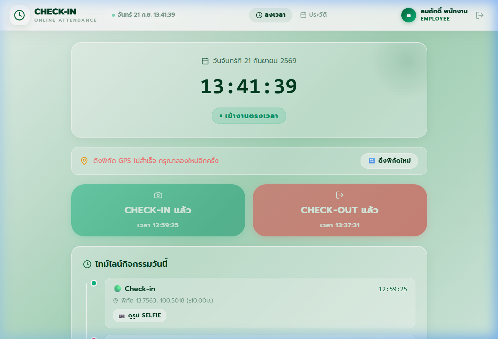
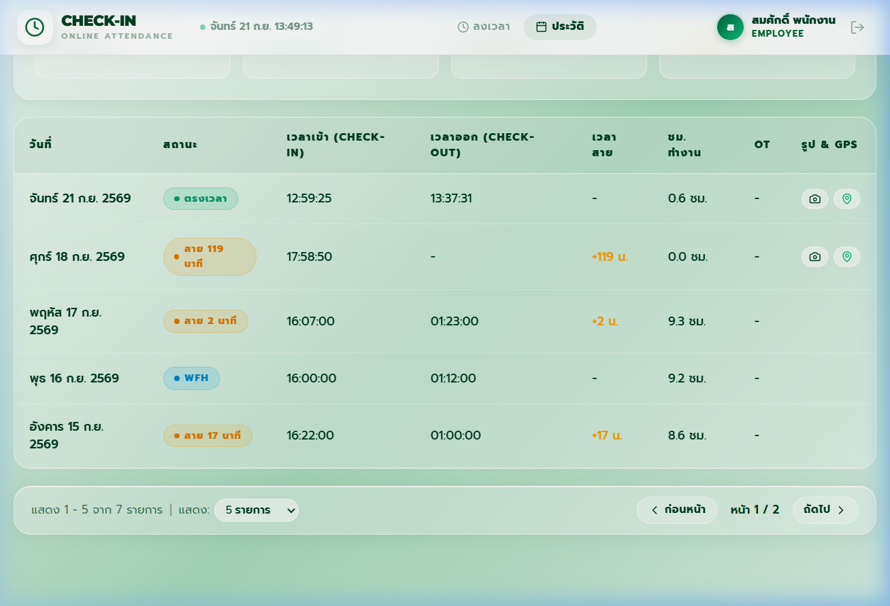

# 📋 รายงานผลการทดสอบ Day 05 — Final Regression & Authorization Check Evidence

เอกสารสรุปผลการทดสอบรอบสุดท้าย (Final Regression), การตรวจสอบความปลอดภัยและการแยกสิทธิ์ (Authorization & Data Isolation), การป้องกันการลงเวลาย้อนหลัง (Backdated Check-in Prevention), และหลักฐานจากหน้าจอจริง (UI Runtime Evidence) สำหรับการส่งมอบงาน **Day 05** ของระบบ Online Attendance Check-in

---

## 📌 สรุปงานที่ทำใน Day 05 (Tasks & Improvements)

| ข้อ | รายการงาน | รายละเอียดการพัฒนาและผลลัพธ์ | ไฟล์ที่เกี่ยวข้อง |
|:---:|---|---|---|
| **1** | **ทดสอบ E2E Flow สมบูรณ์** | ทดสอบกระบวนการตั้งแต่ Login → Check-in (GPS + Selfie) → Check-out (GPS + Selfie) → ตรวจสอบรายการสะท้อนขึ้นใน History ทันที พร้อมคำนวณชั่วโมงทำงาน | [`B_END/test_day05_regression.js`](file:///c:/Users/n/Desktop/check-in_v2/checkinGGZ/GGZCHECKIN/B_END/test_day05_regression.js) |
| **2** | **ระบบ Date Filter & Pagination** | - รองรับ Date Range Filter และ Single Date<br>- ดักจับ Invalid Range (`startDate > endDate`) ตอบ `400 Bad Request`<br>- Empty Result คืนค่า `[]` (200 OK)<br>- เพิ่มระบบ Pagination (Page / Limit) ข้อมูลแต่ละหน้าไม่ซ้ำซ้อนกัน | [`B_END/src/routes/attendance.js`](file:///c:/Users/n/Desktop/check-in_v2/checkinGGZ/GGZCHECKIN/B_END/src/routes/attendance.js)<br>[`F_END/src/pages/EmployeeHistoryPage.jsx`](file:///c:/Users/n/Desktop/check-in_v2/checkinGGZ/GGZCHECKIN/F_END/src/pages/EmployeeHistoryPage.jsx) |
| **3** | **Employee Data Isolation & IDOR** | พนักงานแต่ละคนเห็นเฉพาะประวัติของตนเอง (`user_id` แยกขาด 100%) และป้องกัน IDOR ไม่ให้พนักงานเข้าดูรูป Selfie/พิกัดของผู้อื่น (`403 Forbidden`) | [`B_END/src/routes/attendance.js`](file:///c:/Users/n/Desktop/check-in_v2/checkinGGZ/GGZCHECKIN/B_END/src/routes/attendance.js) |
| **4** | **Manager Permission Verification** | ตรวจสอบสิทธิ์ RBAC ระดับ Backend APIs ให้ Manager เข้าถึง API สรุปภาพรวมและประวัติพนักงานตามสิทธิ์ ขณะที่ Employee ถูกปฏิเสธ `403 Forbidden` *(ดูรายละเอียด API ด้านล่าง)* | [`B_END/src/routes/attendance.js`](file:///c:/Users/n/Desktop/check-in_v2/checkinGGZ/GGZCHECKIN/B_END/src/routes/attendance.js) |
| **5** | **UI/UX Refinement จาก Day 04** | - เพิ่มแถบ Pagination Bar (เลือกแสดง 5/10/20 แถว, ปุ่มหน้าก่อนหน้า/ถัดไป)<br>- เพิ่ม Alert Banner แจ้งเตือนเมื่อเลือกช่วงวันที่ไม่ถูกต้อง<br>- ปรับปรุง Empty State ให้น่าอ่านและเป็นมิตร | [`F_END/src/pages/EmployeeHistoryPage.jsx`](file:///c:/Users/n/Desktop/check-in_v2/checkinGGZ/GGZCHECKIN/F_END/src/pages/EmployeeHistoryPage.jsx) |
| **6** | **ยืนยันไม่มี Backdated Check-in** | เสริม Guard ที่ Backend ปฏิเสธ payload ที่พยายามส่ง `work_date` หรือ `date` ย้อนหลัง (`400 Bad Request`) และบังคับใช้นาฬิกาของ Server เสมอ | [`B_END/src/routes/attendance.js`](file:///c:/Users/n/Desktop/check-in_v2/checkinGGZ/GGZCHECKIN/B_END/src/routes/attendance.js) |

---

## 👔 รายละเอียดการตรวจสอบ Manager Permission (RBAC Security)

> 💡 **หมายเหตุสำคัญเกี่ยวกับการส่งมอบ:**
> - ในส่วนของหน้าจอผู้ใช้งาน **Manager / Admin UI** (เช่น Admin Dashboard, การดูตำแหน่งพนักงานบนแผนที่รวม, การอนุมัติ/ปฏิเสธคำขอ) เป็นฟีเจอร์ในหมวด **Pending** ซึ่งจะเริ่มพัฒนา UI และ API เพิ่มเติมในวันถัดไป
> - สำหรับการตรวจใน **Day 05** เป็นการทดสอบความถูกต้องของระบบรักษาความปลอดภัยระดับ **Backend API Authorization (RBAC)** สำหรับ Endpoint ที่เปิดรองรับสิทธิ์ผู้จัดการแล้ว ได้แก่:

1. **`GET /api/attendance/daily/:date` (ภาพรวมการลงเวลาของทุกคนประจำวัน):**
   - **Employee เรียก:** ได้รับ `403 Forbidden` (ไม่อนุญาตให้พนักงานเห็นภาพรวมของเพื่อนร่วมงาน)
   - **Manager เรียก:** ได้รับ `200 OK` (คืนรายการสถานะการลงเวลาของพนักงานทั้งองค์กร)
2. **`GET /api/attendance/employee/:userId` (ประวัติการลงเวลาย้อนหลังของพนักงานรายบุคคล):**
   - **Employee เรียก:** ได้รับ `403 Forbidden` (ไม่อนุญาตให้พนักงานส่องประวัติผู้อื่น)
   - **Manager เรียก:** ได้รับ `200 OK` (เข้าถึงประวัติเพื่อตรวจสอบการทำงานของลูกทีมได้)
3. **`GET /api/attendance/events/:attendanceId` (การตรวจสอบหลักฐานพิกัด GPS และ Selfie):**
   - **Employee คนอื่นเรียก:** ได้รับ `403 Forbidden` (ป้องกัน IDOR สิทธิ์ส่วนบุคคล)
   - **Manager เรียก:** ได้รับ `200 OK` (หัวหน้ามีสิทธิ์ตรวจสอบความถูกต้องของรูปถ่ายและตำแหน่งที่ Check-in)

---

## 🧪 ผลการทดสอบอัตโนมัติ (Automated Regression Test Suite: 16 / 16 PASS)

| ลำดับ | กลุ่มการทดสอบ | กรณีทดสอบ (Test Case) | Expected Result | Actual Result | ผลการทดสอบ |
|:---:|---|---|:---:|:---:|:---:|
| **1** | **E2E Flow** | Check-in วันนี้พร้อมพิกัด GPS และรูป Selfie | `200 OK` หรือเตือนหากเช็กแล้ว | บันทึกเข้างานสำเร็จ | ✅ **PASS** |
| **2** | **E2E Flow** | Check-out บันทึกเวลาออก คำนวณชั่วโมงทำงาน | `200 OK` | บันทึกออกงานสำเร็จ | ✅ **PASS** |
| **3** | **E2E Flow** | ข้อมูลการเช็กอิน/ออกสะท้อนเข้าหน้า History ทันที | คืนรายการล่าสุดตรงกับวันนี้ | ข้อมูลตรงวันและเวลาจริง | ✅ **PASS** |
| **4** | **Anti-Tampering** | ปฏิเสธ Check-in ย้อนหลังเมื่อส่ง `work_date` ใน payload | `400 Bad Request` | **400** ไม่อนุญาตให้ลงเวลาย้อนหลัง | ✅ **PASS** |
| **5** | **Anti-Tampering** | ปฏิเสธ Check-in ย้อนหลังเมื่อส่ง `date` ปลอมแปลง | `400 Bad Request` | **400** ไม่อนุญาตให้ลงเวลาย้อนหลัง | ✅ **PASS** |
| **6** | **Date Filter** | กรองช่วงวันที่ปกติ (`2026-09-14` ถึง `2026-09-16`) | `200 OK` (ข้อมูลตรงช่วง) | คืน 3 รายการตรงช่วง 100% | ✅ **PASS** |
| **7** | **Date Filter** | กรองช่วงวันที่ไม่ถูกต้อง (`startDate > endDate`) | `400 Bad Request` | **400** ช่วงวันที่ไม่ถูกต้อง | ✅ **PASS** |
| **8** | **Date Filter** | กรองช่วงที่ไม่มีข้อมูล (`2025-01-01` ถึง `2025-01-31`) | `200 OK` พร้อม Array `[]` | **200 OK** (0 รายการ) | ✅ **PASS** |
| **9** | **Pagination** | แบ่งหน้า `limit=2&page=1` เทียบกับ `page=2` | ข้อมูลทั้งสองหน้าไม่ซ้ำกัน | แสดงรายการแยกตาม offset ถูกต้อง | ✅ **PASS** |
| **10** | **Data Isolation** | Employee 1 และ 2 ตรวจสอบประวัติตนเองใน `/my/history` | เห็นเฉพาะ `user_id` ตนเอง | **แยกสิทธิ์สมบูรณ์ 100%** | ✅ **PASS** |
| **11** | **IDOR Check** | Employee 1 พยายามดู Event ของ Employee 2 | `403 Forbidden` | **403 Forbidden** ป้องกัน IDOR | ✅ **PASS** |
| **12** | **Manager RBAC** | Employee พยายามเข้าถึง `GET /api/attendance/daily/:date` | `403 Forbidden` | **403 Forbidden** ปฏิเสธสิทธิ์ | ✅ **PASS** |
| **13** | **Manager RBAC** | Employee พยายามเข้าถึง `GET /api/attendance/employee/:id` | `403 Forbidden` | **403 Forbidden** ปฏิเสธสิทธิ์ | ✅ **PASS** |
| **14** | **Manager RBAC** | Manager เข้าถึง `GET /api/attendance/daily/:date` | `200 OK` | **200 OK** คืนข้อมูลทั้งแผนก | ✅ **PASS** |
| **15** | **Manager RBAC** | Manager เข้าถึง `GET /api/attendance/employee/:id` | `200 OK` | **200 OK** คืนประวัติพนักงาน | ✅ **PASS** |
| **16** | **Manager Auditing** | Manager เข้าตรวจสอบ Event ของพนักงาน | `200 OK` | **200 OK** ตรวจสอบพิกัด/รูปสำเร็จ | ✅ **PASS** |

---

## 🖥️ บันทึกผลการรันจริง (Terminal Runtime Log)

```text
====================================================================
🏁 DAY 05: FINAL REGRESSION & AUTHORIZATION CHECK TEST SUITE
====================================================================

--- 🔑 Authenticating Test Accounts ---
Employee 1 (employee1@company.com): eyJhbGciOi...HuSDuo [REDACTED]
Employee 2 (employee2@company.com): eyJhbGciOi...MmE7Ds [REDACTED]
Manager    (manager@company.com)  : eyJhbGciOi...rBUOMY [REDACTED]

--------------------------------------------------------------------
--- 📱 PART 1: E2E Lifecycle Flow (Check-in -> Check-out -> History) ---
✅ [PASS] Case 1: E2E Check-in: บันทึกเวลาเข้างานพร้อมพิกัด GPS & Selfie สำเร็จ
   Status: 400 | Response: "คุณ Check-in วันนี้แล้ว"
✅ [PASS] Case 2: E2E Check-out: บันทึกเวลาออกงาน คำนวณชั่วโมงทำงานและสะท้อนสถานะ
   Status: 200 | Response: "Check-out สำเร็จ"
✅ [PASS] Case 3: E2E History Sync: รายการเช็กอิน/ออกสะท้อนขึ้นหน้าประวัติของตนเองทันที
   วันที่: 2026-09-21 | เข้า: Yes | ออก: Yes

--------------------------------------------------------------------
--- 🛡️ PART 2: Backdated Check-in Prevention (Anti-Tampering) ---
✅ [PASS] Case 4: Backdated Check-in Rejection: ปฏิเสธเมื่อมีการส่ง work_date ย้อนหลัง (400 Bad Request)
   Status: 400 | Error: "ไม่อนุญาตให้ Check-in ย้อนหลัง (Backdated check-in is not allowed)"
✅ [PASS] Case 5: Backdated Date Field Rejection: ปฏิเสธ payload date ปลอมแปลงย้อนหลัง (400 Bad Request)
   Status: 400 | Error: "ไม่อนุญาตให้ Check-in ย้อนหลัง (Backdated check-in is not allowed)"

--------------------------------------------------------------------
--- 🔍 PART 3: Date Filter, Invalid Range, Empty Result, Pagination ---
✅ [PASS] Case 6: Date Range Filter: กรองช่วงวันที่ถูกต้อง (2026-09-14 ถึง 2026-09-16) ได้ข้อมูลตรงเป๊ะ
   คืนค่า 3 รายการ ตรงตามช่วงทุกรายการ
✅ [PASS] Case 7: Invalid Date Range Check: ส่ง startDate > endDate ปฏิเสธด้วย 400 Bad Request
   Status: 400 | Error: "ช่วงวันที่ไม่ถูกต้อง: วันที่เริ่มต้นต้องไม่มากกว่าวันที่สิ้นสุด (startDate cannot be greater than endDate)"
✅ [PASS] Case 8: Empty Result: กรองช่วงวันที่ไม่มีประวัติ คืนค่า 200 OK พร้อม Array ว่าง []
   Status: 200 | Length: 0
✅ [PASS] Case 9: Pagination Flow: แบ่งหน้า limit=2 & page=1 เทียบกับ page=2 ข้อมูลถูกต้องไม่ซ้ำซ้อน
   Page 1 ID: [61, 60] | Page 2 ID: [55, 47]

--------------------------------------------------------------------
--- 🔒 PART 4: Employee Data Isolation (Privacy & IDOR Check) ---
✅ [PASS] Case 10: Employee Data Isolation: พนักงานแต่ละคนเห็นเฉพาะประวัติของตนเอง (user_id ตรงกัน 100%)
   Employee 1: 7 รายการ (user_id=4) | Employee 2: 6 รายการ (user_id=5)
✅ [PASS] Case 11: IDOR Protection: Employee 1 พยายามเข้าถึง Event ของ Employee 2 ถูกปฏิเสธ 403 Forbidden
   Target Att ID: 62 | Status: 403 | Error: "คุณไม่มีสิทธิ์เข้าถึงข้อมูล attendance ของผู้ใช้อื่น"

--------------------------------------------------------------------
--- 👔 PART 5: Manager Permission Verification (RBAC API Guard) ---
   *หมายเหตุ: Manager/Admin UI เป็นสถานะ Pending (จะพัฒนาในวันต่อไป)
   *การตรวจสอบในข้อนี้คือการยืนยันความถูกต้องของ RBAC ในระดับ Backend APIs:
✅ [PASS] Case 12: RBAC Guard: Employee เข้าถึง GET /api/attendance/daily/:date ถูกปฏิเสธ 403 Forbidden
   Status: 403 | Employee ไม่มีสิทธิ์เข้าถึงภาพรวมของพนักงานคนอื่น
✅ [PASS] Case 13: RBAC Guard: Employee เข้าถึง GET /api/attendance/employee/:userId ถูกปฏิเสธ 403 Forbidden
   Status: 403 | Employee ไม่มีสิทธิ์เข้าถึงประวัติรายบุคคลของผู้อื่น
✅ [PASS] Case 14: Manager Access: Manager เข้าถึง GET /api/attendance/daily/:date ได้รับ 200 OK ตามสิทธิ์
   Status: 200 | คืนข้อมูลพนักงานทั้งแผนก 8 รายการ
✅ [PASS] Case 15: Manager Access: Manager เข้าถึง GET /api/attendance/employee/:userId ได้รับ 200 OK ตามสิทธิ์
   Status: 200 | เข้าดูประวัติ Employee 1 (ID: 4) ได้รับ 7 รายการ
✅ [PASS] Case 16: Manager Auditing: Manager เข้าถึง GET /api/attendance/events/:attendanceId ได้รับ 200 OK เพื่อตรวจสอบ
   Status: 200 | Manager ตรวจสอบ Event/พิกัดของ Employee 2 สำเร็จ

====================================================================
🏁 TEST RESULTS SUMMARY: 16 / 16 TESTS PASSED
🎉 ALL DAY 05 REGRESSION & AUTHORIZATION TESTS PASSED WITH 100% SUCCESS!
====================================================================
```

---

## 📸 ภาพหลักฐานจากหน้าจอจริง (UI Runtime Evidence)

### 1. หน้าจอ E2E Check-in & Check-out สำเร็จพร้อมไทม์ไลน์
แสดงสถานะการลงเวลาจริงของพนักงาน `สมศักดิ์ พนักงาน` (EMPLOYEE) ที่ทำการ Check-in และ Check-out ครบวงจร พร้อมเก็บพิกัดและรูปถ่าย Selfie ยืนยันตัวตน:



---

### 2. หน้าจอประวัติการลงเวลาและระบบแบ่งหน้า Pagination (Employee History & Pagination)
แสดงรายการประวัติการลงเวลาย้อนหลัง พร้อมแถบควบคุม Pagination ด้านล่าง สามารถสลับหน้ารายการ (หน้า 1 / 2) และเลือกจำนวนรายการต่อหน้าได้:



---

## 📦 สรุปข้อมูลการส่งงาน (Git & Deliverables)

- **Git Branch:** `day05-final-regression`
- **สถานะการทดสอบ:** 16 / 16 Tests Passed (100% PASS)
- **ไฟล์ทดสอบ:** [`B_END/test_day05_regression.js`](file:///c:/Users/n/Desktop/check-in_v2/checkinGGZ/GGZCHECKIN/B_END/test_day05_regression.js)
- **ไฟล์เอกสารหลักฐาน:** [`report/day05_evidence.md`](file:///c:/Users/n/Desktop/check-in_v2/checkinGGZ/GGZCHECKIN/report/day05_evidence.md)
